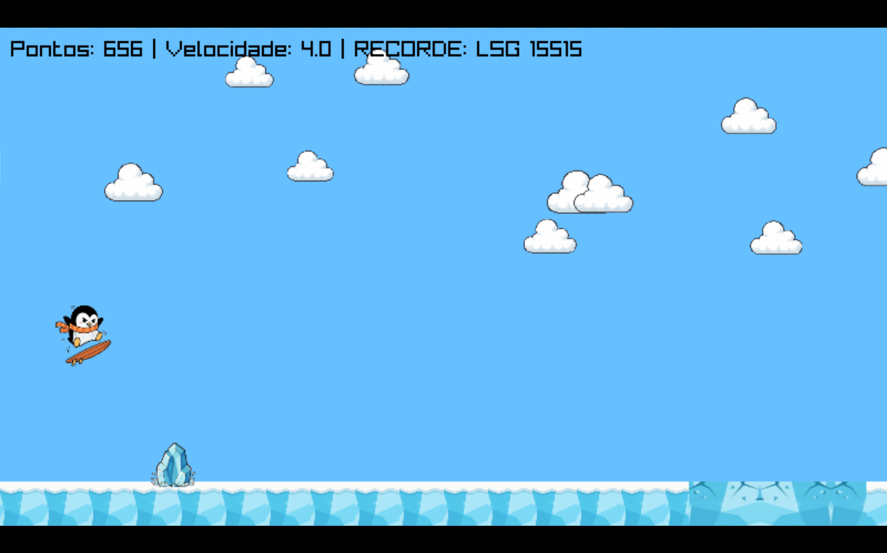
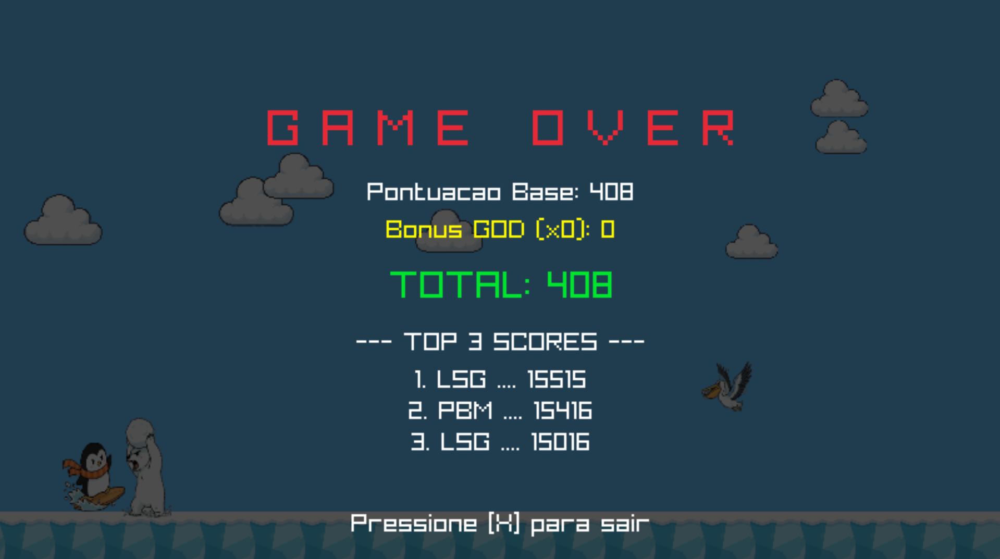

# Pengoo! ❄️

## Descrição do Projeto 

O **Pengoo** é um game baseado no cliff jump (pou), em que o personagem principal, Pengo, surfa em uma prancha e deve saltar e desviar de rachaduras no chão, obstáculos terrestres/aéreos para evitar cair ou colidir.

## 🎥 Gameplay (YouTube) 
➡️ **[Clique aqui para assistir à gameplay no YouTube](https://youtu.be/cSVGJa9Q814?feature=shared)**

## Mecânicas do Game 🎮

  <li> Jogador pressiona o botão espaço para fazer o Pengo pular, se apertar duas vezes faz um pulo duplo.
  <li> Ao coletar o Cristal Roxo, Jogador ganha o poder de pulo triplo temporariamente com o Pengo EVO.
  <li> Ao coletar a Gaviota especial, Jogador ganha o poder de imortalidade temporária com o Pengo GOLD.
  <li> Ao coletar os dois poderes, Jogador fica com os dois poderes ao mesmo tempo temporariamente e o Pengo se transfoma em Pengo GOD.
  <li> Jogador deve desviar de ursos polares, obstáculos de gelo, gaivotas e gelo quebrando no chão.

## Poderes do Pengo:

 
 
 

---

## Imagens do Game :
  
 
 

---

## 💻 Como Baixar e Compilar
Para jogar **Pengoo!**, você precisará clonar o repositório e compilar o código-fonte.

### 1. Pré-requisitos
Certifique-se de ter instalado em sua máquina:

- Git  
- Compilador C (GCC)  
- Raylib (via gerenciador de pacotes no Linux)  

⚠️ **Atenção:** O jogo foi desenvolvido e testado apenas em **Linux**.  
A compatibilidade com **macOS** e **Windows** não foi verificada.

---

### 2. Clonando o Repositório
Abra seu terminal e execute:

git clone https://github.com/mateuslinsf/Pengoo.git
cd Pengoo

---

### 3. Compilando e Rodando (Linux)

Compile o jogo:

gcc main.c game.c-o pengoo -lraylib -1GL-1m-lpthread-1dl-Irt-1X11

Para rodar o jogo:

./pengoo

---
